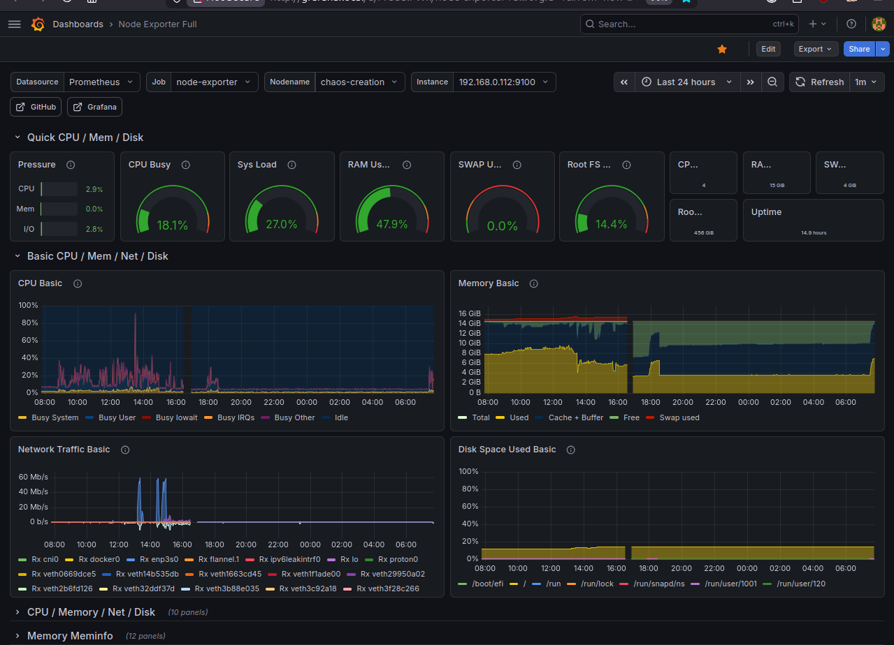
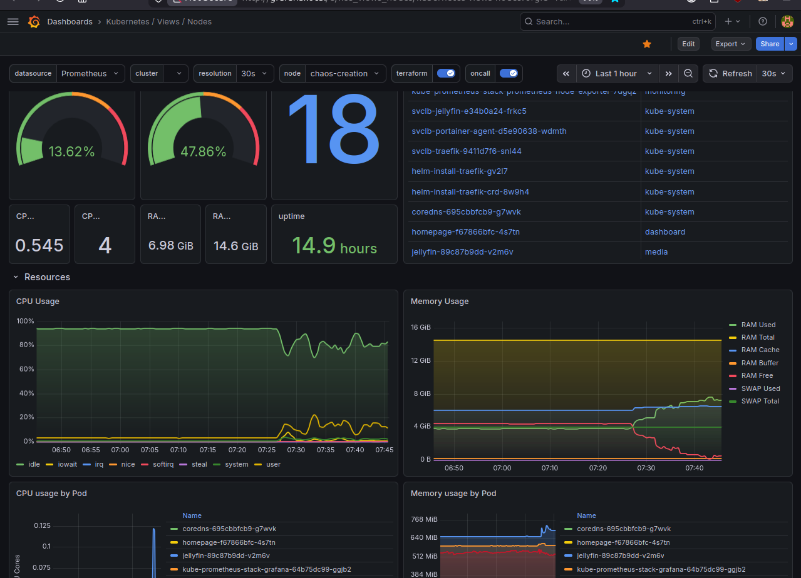
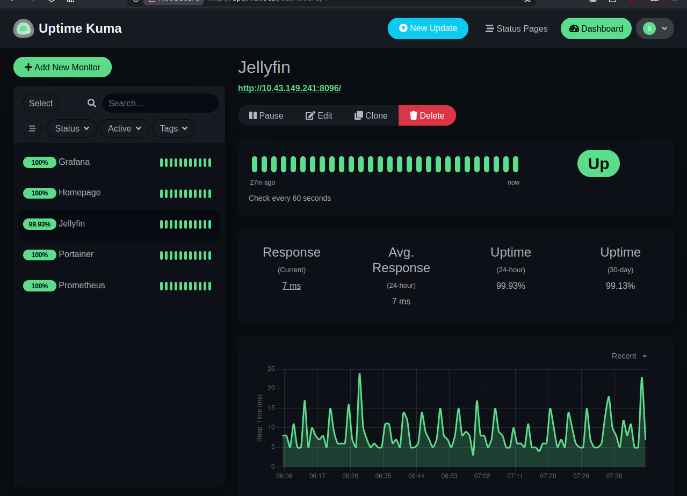
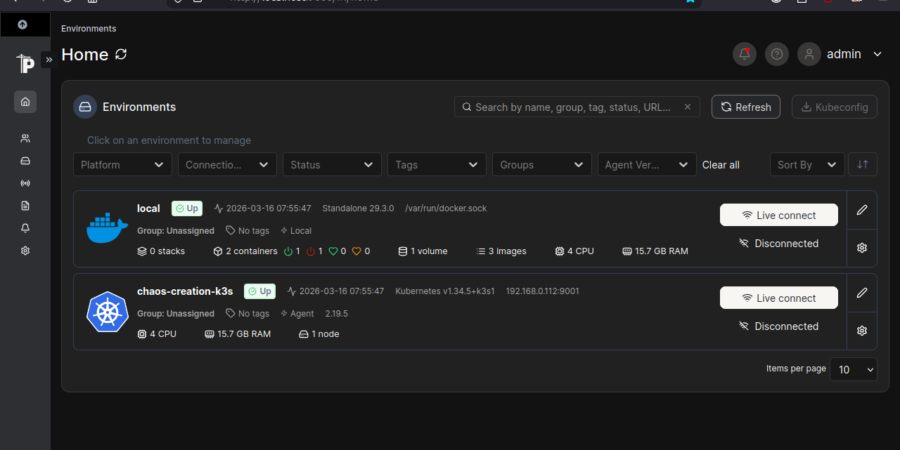

<div align="center">

# 🏠 chaos-creation homelab


*A fully automated homelab running on a single Ubuntu machine*


</div>

---

## 📋 Table of Contents

- [Hardware](#hardware)
- [Architecture](#architecture)
- [Stack](#stack)
- [Screenshots](#screenshots)
- [Quick Start](#quick-start)
- [Services](#services)
- [Media Management](#media-management)
- [Useful Commands](#useful-commands)
- [Whats Next](#whats-next)

---

## 🖥️ Hardware

| Component | Details |
|---|---|
| **Hostname** | chaos-creation |
| **CPU** | AMD Ryzen 3 2200G (4 cores @ 3.5GHz) |
| **RAM** | 16GB DDR4 |
| **Disk** | 500GB HDD |
| **GPU** | Radeon Vega 8 (integrated) |
| **OS** | Ubuntu 24.04.4 LTS |
| **IP** | 192.168.0.112 (static) |

---

## 🏗️ Architecture
```
                    🌐 Home Network (192.168.0.x)
                                 │
                         ┌───────┴────────┐
                         │  chaos-creation │
                         │  192.168.0.112  │
                         └───────┬────────┘
                                 │
               ┌─────────────────┴──────────────────┐
               │                                    │
            Docker                               K3s
               │                                    │
           Portainer                    ┌────────────┼───────────┐
        (container UI)              Traefik       CoreDNS    Metrics
                                  (ingress)        (DNS)      Server
                                       │
          ┌──────────────────────────┬─┴────────────────────────┐
          │                          │                           │
     monitoring/                 media/                      tools/
          │                          │                           │
   Grafana + Prometheus           Jellyfin              Uptime Kuma
```

---

## 📦 Stack

### Infrastructure
| Tool | Version | Purpose |
|---|---|---|
| Ubuntu | 24.04.4 LTS | Host OS |
| Docker | 29.3.0 | Container runtime |
| K3s | v1.34.5+k3s1 | Lightweight Kubernetes |
| Helm | v3.20.1 | K8s package manager |
| Ansible | 2.20.3 | Automation |
| Traefik | v3.6.9 | Ingress controller |

### Applications
| App | Namespace | URL | Purpose |
|---|---|---|---|
| Homepage | dashboard | http://home.local | Homelab dashboard |
| Grafana | monitoring | http://grafana.local | Metrics visualization |
| Prometheus | monitoring | http://prometheus.local | Metrics collection |
| Jellyfin | media | http://jellyfin.local | Media server |
| Uptime Kuma | tools | http://uptime.local | Uptime monitor |
| Portainer | Docker | http://localhost:9000 | Container manager |

---

## 📸 Screenshots

### 🏠 Homepage Dashboard


### 📊 Grafana — System Stats


### 📊 Grafana — K3s Cluster


### 🎬 Jellyfin Media Server


### 🔍 Uptime Kuma


### 🐳 Portainer


---

## 🚀 Quick Start

### Prerequisites
```bash
sudo apt update && sudo apt upgrade -y
sudo apt install -y curl wget git vim htop python3 python3-pip
sudo add-apt-repository --yes --update ppa:ansible/ansible
sudo apt install -y ansible
ansible-galaxy collection install kubernetes.core community.general
pip3 install kubernetes --break-system-packages
```

### Clone & Configure
```bash
git clone https://github.com/saikumar-agiri/homelab.git
cd homelab
cp .env.example .env
nano .env
nano inventory/hosts.ini
```

### Deploy
```bash
cd playbooks/
ansible-playbook -i ../inventory/hosts.ini 01_install_docker.yml --ask-become-pass
ansible-playbook -i ../inventory/hosts.ini 02_install_k3s.yml --ask-become-pass
ansible-playbook -i ../inventory/hosts.ini 03_setup_repos.yml --ask-become-pass
ansible-playbook -i ../inventory/hosts.ini 04_deploy_monitoring.yml --ask-become-pass
ansible-playbook -i ../inventory/hosts.ini 05_deploy_pihole.yml --ask-become-pass
ansible-playbook -i ../inventory/hosts.ini 06_deploy_jellyfin.yml --ask-become-pass
ansible-playbook -i ../inventory/hosts.ini 07_deploy_uptimekuma.yml --ask-become-pass
ansible-playbook -i ../inventory/hosts.ini 08_deploy_homepage.yml --ask-become-pass
ansible-playbook -i ../inventory/hosts.ini 09_deploy_portainer.yml --ask-become-pass
```

---

## 🌐 Services

### 📊 Monitoring
- **Grafana** — Beautiful metrics dashboards (Node Exporter ID: 1860, K3s ID: 15759)
- **Prometheus** — Metrics collection with node exporter and kube state metrics
- **Uptime Kuma** — Real-time service uptime monitoring

### 🎬 Media
- **Jellyfin** — Self hosted media server accessible on all home network devices
- Accessible at `http://192.168.0.112:8096` from any device on your network

### 🔧 Management
- **Portainer** — Visual Docker and K3s management
- **Homepage** — Central dashboard for all services

---

## 🎬 Media Management

### Adding Movies
```
/mnt/media/movies/
└── Movie Name (Year)/
    └── Movie Name (Year).mkv
```

### Media Organizer Script
```bash
~/homelab/scripts/organize_media.sh
```

### Temp Download Stack
```bash
# Spin up
ansible-playbook -i inventory/hosts.ini playbooks/start_mediastack.yml --ask-become-pass

# Tear down
ansible-playbook -i inventory/hosts.ini playbooks/stop_mediastack.yml --ask-become-pass
```

---

## 🔧 Useful Commands
```bash
# Check all running pods
kubectl get pods -A

# Check resource usage
kubectl top pods -A
kubectl top nodes

# Restart a service
kubectl rollout restart deployment <name> -n <namespace>

# Check logs
kubectl logs -n <namespace> <pod-name>

# Helm releases
helm list -A
```

---

## 📊 Grafana Dashboards

| Dashboard | ID |
|---|---|
| Node Exporter Full | 1860 |
| K3s Cluster Monitoring | 15759 |

---

## ⚠️ Whats Next

### 🔴 High Priority
- [ ] SSH setup
- [ ] Tailscale — secure remote access
- [ ] SSL/HTTPS — cert-manager + Let's Encrypt

### 🟡 Medium Priority
- [ ] Grafana alerting
- [ ] Pi-hole — network-wide ad blocking
- [ ] Ansible Vault — encrypt credentials

### 🟢 Nice to Have
- [ ] Nextcloud
- [ ] Vaultwarden
- [ ] Gitea
- [ ] Watchtower
- [ ] Loki + Promtail

---

## 📚 Resources

| Resource | URL |
|---|---|
| K3s Docs | https://docs.k3s.io |
| Ansible Docs | https://docs.ansible.com |
| Helm Docs | https://helm.sh/docs |
| Traefik Docs | https://doc.traefik.io/traefik |
| Jellyfin Docs | https://jellyfin.org/docs |
| Homepage Docs | https://gethomepage.dev |

---

<div align="center">

*Built with ☕ on chaos-creation*

</div>
